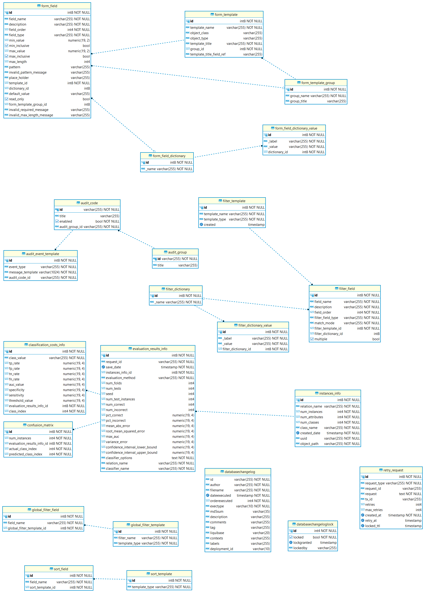

= Техническая документация системы ECA SERVICE
:toc: macro

== Введение

Программная система представляет собой серверное решение для построения различных моделей классификаторов, а также
расчёта их основных показателей точности. Система поддерживает построение одиночных и ансамблевых моделей классификаторов.

== 1. Функции системы

1. Построение одиночных и ансамблевых моделей классификаторов.
2. API Data Miner, основным предназначением которого является автоматический подбор оптимальных
параметров для одиночных и ансамблевых алгоритмов на основе серии экспериментов.
3. Наполнение базы знаний результатов классификации разнотипных данных с использованием
различных алгоритмов классификации, как одиночных так и ансамблевых.
4. API для нахождения оптимальных параметров классификаторов для конкретной обучающей выборки на основе накопленной
истории результатов классификации.
5. UI для работы с заявками на построение моделей классификаторов.
6. Возможность добавления/изменения конфигураций экспериментов через UI.
7. Административная панель для управления пользователями системы.
8. Личный кабинет пользователя с основными операциями:

    * Редактирование основных данных (ФИО и т.д.)
    * Изменение email
    * Изменение пароля
    * Восстановление пароля
    * Загрузка аватара
9. UI для сохранения файлов с обучающей выборкой в БД в виде таблиц.

== 2. Архитектура решения

=== 2.1 Диаграмма взаимодействия компонентов

На рисунке 2.1 представлена диаграмма взаимодействия основных компонентов системы Eca - service, за исключением
связей с системными сервисами мониторинга, логирования:

image::./images/es-architecture.png[alt=Диаграмма взаимодействия компонентов,scaledwidth=80%]

==== Таблица 1.1 - Описание компонентов диграммы взаимодействия

|===
|№|Компонент|Описание
|1
|Eca desktop
|Представляет собой настольное приложение ECA, установленное на ПК
|2
|Browser
|Представляет собой административную панель для работы с заявками на построение моделей классификаторов
|3
|Eca web
|Angular приложение, обернутое в spring boot. Реализует Web клиент для работы с заявками на построение моделей классификаторов
|4
|Rabbit MQ
|Брокер сообщений на построение моделей от Eca desktop
|5
|API gateway (zuul gate)
|Модуль единой точки входа для проксирования http запросов во внутренние микросервисы
|6
|Discovery server
|Eureka сервер для регистрации микросервисов
|7
|Eca server
|Основной модуль, который принимает сообщения для обучения моделей классификаторов. Модуль предоставляет REST API по работе с заявками для web приложения.
|8
|Eca oauth
|Модуль авторизации и управления пользователями. Модуль предоставляет REST API по работе с пользователями для web приложения.
|9
|Eca ers
|Сервис для хранения и анализа результатов классификации. Сервис предоставляет REST API для получения/сохранения результатов классификации.
|10
|Eca data storage
|Модуль для хранения обучающих выборок в виде таблиц БД. Модуль предоставляет REST API по работе с выборками для web приложения.
|11
|Eca mail
|Модуль для отправки почты и хранения шаблонов email - сообщений. Модуль предоставляет REST API для отправки нотификаций в соответствии с заданным шаблоном сообщения.
|12
|PostgreSQL
|База данных PostgreSQL для конкретного микросервиса
|13
|Redis
|Распределенная in-memory БД для хранения временных данных
|===

=== 2.2 Диаграмма взаимодействия с системными сервисами

На рисунке 2.2 представлена полная диаграмма взаимодействия с системными сервисами:

image::./images/es-ss-architecture.png[alt=Диаграмма взаимодействия с системными сервисами,scaledwidth=80%]

==== Таблица 1.2 - Описание компонентов диграммы взаимодействия с системными сервисами

|===
|№|Компонент|Описание
|1
|Eca - service
|Система eca - service
|2
|PostgreSQL
|Сервер PostgreSQL с основными БД приложения
|3
|Rabbit MQ
|Брокер сообщений
|4
|Prometheus
|Система для сбора метрик с основных компонентов приложения
|5
|Grafana
|Web клиент для визуализации метрик из prometheus
|6
|Alertmanager
|Система для отправки уведомлений мониторинга в различные каналы
|7
|Alertmanager adapter
|Интеграционный адаптер для преобразования запросов от alertmanager в форматы для отправки в различные каналы
|8
|SMTP server
|Сервер для отправки почты с уведомлениями мониторинга
|9
|Telegram
|Telegram канал для полученя уведомлений мониторинга
|10
|Filebeat
|Система для чтения логов docker - контейнеров с последующей их отправкой в elasticsearch хранилище
|11
|Elasticsearch
|Хранилище логов для всех микросервисов
|12
|Kibana
|Web клиент для просмотра логов
|===

=== 2.3 Диаграмма последовательности для построения модели классификатора

На рисунке 2.3 представлена диаграмма последовательности для построения модели классификатора:

image::./images/evaluation-request-sequence.png[alt=Диаграмма последовательности для построения модели классификатора,scaledwidth=80%]

=== 2.4 Диаграмма последовательности для построения оптимального классификатора

На рисунке 2.4 представлена диаграмма последовательности для построения оптимального классификатора:

=== 2.5 Диаграмма последовательности для создания заявки на эксперимент

На рисунке 2.4 представлена диаграмма последовательности для создания заявки на эксперимент:

image::./images/experiment-request-sequence.png[alt=Диаграмма последовательности для создания заявки на эксперимент,scaledwidth=80%]

== 3. Схема базы данных

=== 3.1 Схема БД eca-server

На рисунке 3.1 приведена схема базы данных eca-server:

image::./images/eca-db-schema.png[alt=Схема базы данных eca-server,scaledwidth=80%]

=== 3.3 Схема БД eca-oauth

На рисунке 3.2 приведена схема базы данных eca-oauth:

image::./images/eca-oauth-db-schema.png[alt=Схема базы данных eca-oauth,scaledwidth=80%]

=== 3.4 Описание БД eca-oauth

==== Таблица 3.11 - 'user_entity' - содержит данные о пользователях
[cols="^20%,^14%,^8%,^8%,^8%,^30%",options="header"]
|===
|Название колонки|Тип|Unique|Not NULL|Индекс|Описание
|id                      |bigint           |+|+|+                              |Идентификатор записи (первичный ключ)
|creation_date           |timestamp        |-|+|-                              |Дата создания пользователя
|login                   |varchar(255)     |+|+|login_unique_index             |Логин пользователя
|password                |varchar(255)     |-|+|-                              |Хеш пароля пользователя
|email                   |varchar(255)     |+|+|email_unique_index             |Email пользователя
|first_name              |varchar(255)     |-|+|-                              |Имя пользователя
|last_name               |varchar(255)     |-|+|-                              |Фамилия пользователя
|middle_name             |varchar(255)     |-|+|-                              |Отчество пользователя
|tfa_enabled             |boolean          |-|-|-                              |Вкл./выкл. двухфакторную аутентификацию
|locked                  |boolean          |-|-|-                              |Вкл./выкл. блокировку пользователя
|password_date           |timestamp        |-|-|-                              |Дата последнего изменения пароля
|===

==== Таблица 3.11 - 'role_entity' - содержит данные о ролях
[cols="^20%,^14%,^8%,^8%,^8%,^30%",options="header"]
|===
|Название колонки|Тип|Unique|Not NULL|Индекс|Описание
|id                      |bigint           |+|+|+                              |Идентификатор записи (первичный ключ)
|role_name               |varchar(255)     |+|+|role_name_unique_index         |Технический код роли
|description             |varchar(255)     |-|-|-                              |Описание роли
|===

==== Таблица 3.11 - 'user_role' - содержит данные о соответствиях пользователи - роли
[cols="^20%,^14%,^8%,^8%,^8%,^30%",options="header"]
|===
|Название колонки|Тип|Unique|Not NULL|Индекс|Описание
|user_id                      |bigint           |-|+|fk_user_role_user_id      |Внешний ключ пользователя
|role_id                      |bigint           |-|+|fk_user_role_role_id      |Внешний ключ роли
|===

Таблица также содержит составной первичный ключ для полей user_id, role_id

==== Таблица 3.11 - 'user_photo' - содержит данные о фотографиях пользователей
[cols="^20%,^14%,^8%,^8%,^8%,^30%",options="header"]
|===
|Название колонки|Тип|Unique|Not NULL|Индекс|Описание
|id                      |bigint           |+|+|+                              |Идентификатор записи (первичный ключ)
|file_name               |varchar(255)     |-|-|-                              |Название файла с фотографией
|file_extension          |varchar(255)     |-|-|-                              |Расширение файла
|photo                   |bytea            |-|-|-                              |Фотография в двоичном виде
|user_id                 |bigint           |-|+|fk_user_photo_user_id          |Внешний ключ пользователя
|===

==== Таблица 3.11 - 'reset_password_request' - содержит данные о запросах на восстановление пароля
[cols="^20%,^14%,^8%,^8%,^8%,^30%",options="header"]
|===
|Название колонки|Тип|Unique|Not NULL|Индекс|Описание
|id                      |bigint           |+|+|+                                          |Идентификатор записи (первичный ключ)
|token                   |varchar(255)     |+|+|reset_password_request_token_unique_index  |Короткоживущий токен для восстановления пароля
|expire_date             |timestamp        |-|+|-                                          |Дата истечения срока действия токена
|reset_date              |timestamp        |-|+|-                                          |Дата восстановления пароля
|user_id                 |bigint           |-|+|fk_reset_password_request_user_id          |Внешний ключ пользователя
|===

==== Таблица 3.11 - 'change_password_request' - содержит данные о запросах на смену пароля
[cols="^20%,^14%,^8%,^8%,^8%,^30%",options="header"]
|===
|Название колонки|Тип|Unique|Not NULL|Индекс|Описание
|id                      |bigint           |+|+|+                                          |Идентификатор записи (первичный ключ)
|token                   |varchar(255)     |+|+|change_password_request_token_unique_index |Короткоживущий токен для смены пароля
|expire_date             |timestamp        |-|+|-                                          |Дата истечения срока действия токена
|confirmation_date       |timestamp        |-|+|-                                          |Дата подтверждения смены пароля
|user_id                 |bigint           |-|+|fk_change_password_request_user_id         |Внешний ключ пользователя
|===

Таблицы databasechangeloglock и databasechangeloglock предназначены для управления миграциями базы данных.
Таблицы с префиксом oauth_ предназначены для работы с библиотекой spring security oauth2.

=== 3.5 Схема БД eca-ers

На рисунке 3.3 приведена схема базы данных eca-ers:

=== 3.7 Схема БД eca-data-storage

На рисунке 3.4 приведена схема базы данных eca-data -storage:

image::./images/eca-data-storage-db-schema.png[alt=Схема базы данных eca-data-storage,scaledwidth=80%]

=== 3.8 Описание таблиц БД eca-data-storage

==== Таблица 3.8 - 'instances' - данные о таблицах с обучающими выборками
[cols="^20%,^14%,^8%,^8%,^8%,^30%",options="header"]
|===
|Название колонки|Тип|Unique|Not NULL|Индекс|Описание
|id                      |bigint           |+|+|+                       |Идентификатор записи (первичный ключ)
|table_name              |varchar(255)     |+|+|table_name_unique_index |Название таблицы с данными
|num_instances           |integer          |-|-|-                       |Число объектов обучающей выборки
|num_attributes          |integer          |-|-|-                       |Число атрибутов обучающей выборки
|creation_date           |timestamp        |-|+|-                       |Дата создания записи
|created_by              |varchar(255)     |-|+|-                       |Пользователь, который добавил обучающую выборку
|===

Таблицы databasechangeloglock и databasechangeloglock предназначены для управления миграциями базы данных.

=== 3.9 Схема БД eca-mail

На рисунке 3.5 приведена схема базы данных eca-mail:

=== 3.10 Описание таблиц БД eca-mail

==== Таблица 3.9 - 'email' - содержит данные о запросах на отправку email
[cols="^20%,^14%,^8%,^8%,^8%,^30%",options="header"]
|===
|Название колонки|Тип|Unique|Not NULL|Индекс|Описание
|id                      |bigint           |+|+|+                       |Идентификатор записи (первичный ключ)
|uuid                    |varchar(255)     |-|-|-                       |Уникальный UUID запроса
|sender                  |varchar(255)     |-|-|-                       |Адрес отправителя
|receiver                |varchar(255)     |-|-|-                       |Адрес получателя
|subject                 |varchar(255)     |-|-|-                       |Тема письма
|message                 |text             |-|-|-                       |Тело сообщения
|save_date               |timestamp        |-|-|-                       |Дата создания запроса
|sent_date               |timestamp        |-|-|-                       |Дата отправки письма
|status                  |varchar(255)     |-|-|-                       |Статус отправки письма
|error_message           |text             |-|-|-                       |Текст ошибки при отправке письма
|failed_attempts_to_sent |integer          |-|-|-                       |Число попыток отправки письма
|tx_id                   |varchar(255)     |-|-|-                       |Идентификатор для кросс-системного логирования
|===

==== Таблица 3.9 - 'regex' - содержит данные о регулярных выражениях для переменных шаблонов
[cols="^20%,^14%,^8%,^8%,^8%,^30%",options="header"]
|===
|Название колонки|Тип|Unique|Not NULL|Индекс|Описание
|id                      |bigint           |+|+|+                       |Идентификатор записи (первичный ключ)
|created                 |timestamp        |-|+|-                       |Дата создания записи
|regex_code              |varchar(255)     |+|+|regex_code_unique_idx   |Технический код регулярного выражения
|regex                   |varchar(255)     |-|+|-                       |Строка регулярного выражения
|description             |varchar(255)     |-|+|-                       |Описание регулярного выражения
|===

==== Таблица 3.10 - 'template' - содержит данные о шаблонах email - ообщений
[cols="^20%,^14%,^8%,^8%,^8%,^30%",options="header"]
|===
|Название колонки|Тип|Unique|Not NULL|Индекс|Описание
|id                      |bigint           |+|+|+                        |Идентификатор записи (первичный ключ)
|created                 |timestamp        |-|+|-                        |Дата создания записи
|template_code           |varchar(255)     |+|+|template_code_unique_idx |Технический код шаблона
|description             |varchar(255)     |-|+|-                        |Описание шаблона
|template_subject        |varchar(255)     |-|+|-                        |Тема шаблона
|template_body           |varchar(255)     |-|+|-                        |Текст шаблона
|===

==== Таблица 3.11 - 'template_parameter' - содержит данные о параметрах шаблонов email - ообщений
[cols="^20%,^14%,^8%,^8%,^8%,^30%",options="header"]
|===
|Название колонки|Тип|Unique|Not NULL|Индекс|Описание
|id                      |bigint           |+|+|+                              |Идентификатор записи (первичный ключ)
|created                 |timestamp        |-|+|-                              |Дата создания записи
|parameter_name          |varchar(255)     |+|+|parameter_name_unique_idx      |Название переменной шаблона
|description             |varchar(255)     |-|+|-                              |Описание переменной шаблона
|regex_id                |bigint           |-|-|fk_template_parameter_regex_id |Внешний ключ регулярного выражения
|===

==== Таблица 3.11 - 'templates_parameters' - таблица соответствий для шаблонов и параметров
[cols="^20%,^14%,^8%,^8%,^8%,^30%",options="header"]
|===
|Название колонки|Тип|Unique|Not NULL|Индекс|Описание
|template_id                      |bigint           |-|+|fk_templates_parameters_template_id  |Внешний ключ шаблона
|parameter_id                     |bigint           |-|+|fk_templates_parameters_param_id     |Внешний ключ параметра шаблона
|===

Таблица также содержит составной первичный ключ для полей template_id, param_id.

Таблицы databasechangeloglock и databasechangeloglock предназначены для управления миграциями базы данных.
