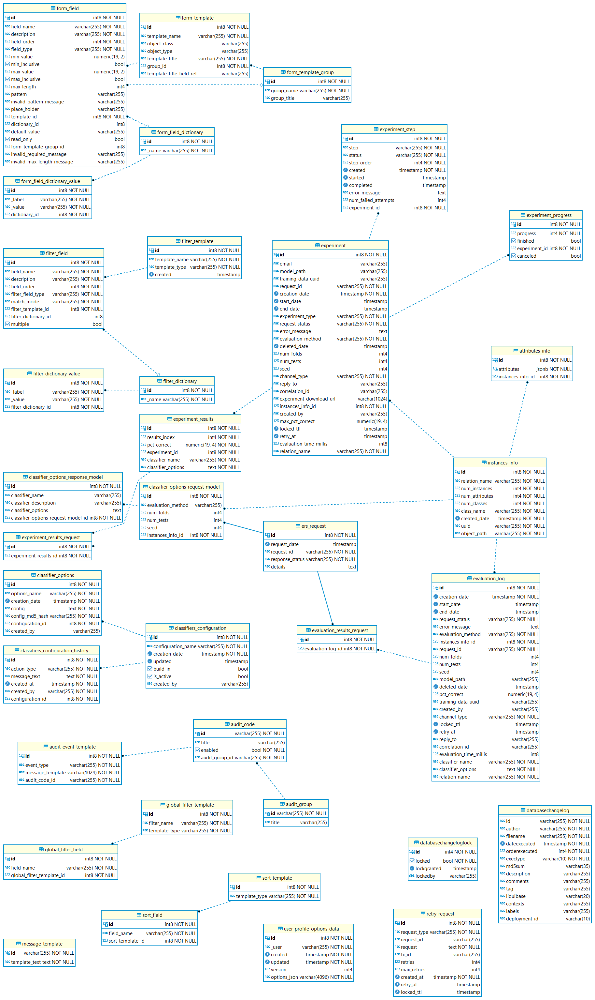
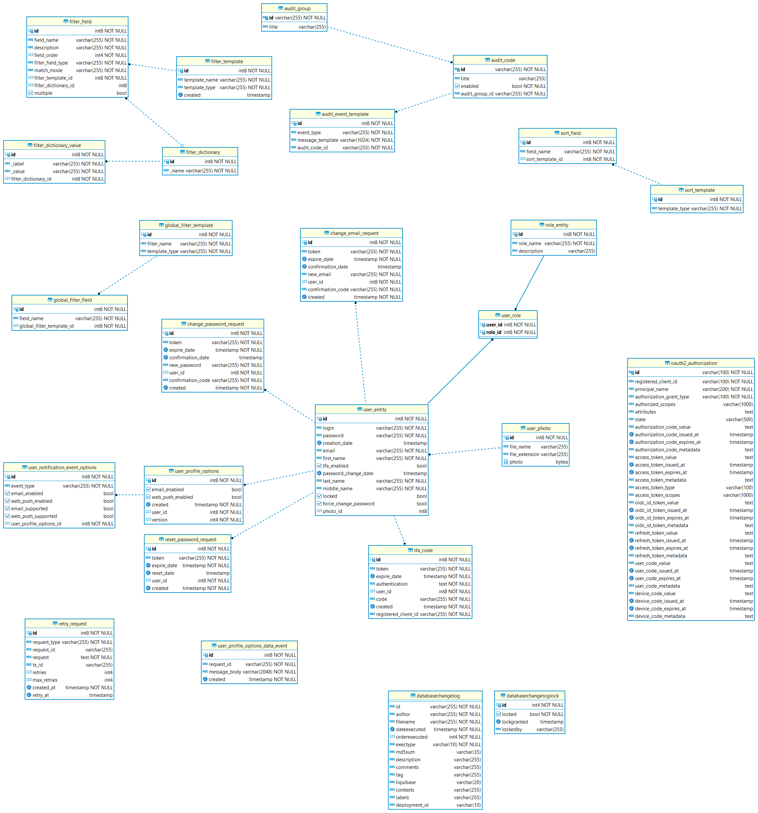

= Техническая документация системы ECA SERVICE
:toc: macro

== Введение

Программная система представляет собой серверное решение для построения различных моделей классификаторов, а также
расчёта их основных показателей точности. Система поддерживает построение одиночных и ансамблевых моделей классификаторов.

== 1. Функции системы

1. Построение одиночных и ансамблевых моделей классификаторов.
2. API Data Miner, основным предназначением которого является автоматический подбор оптимальных
параметров для одиночных и ансамблевых алгоритмов на основе серии экспериментов.
3. Наполнение базы знаний результатов классификации разнотипных данных с использованием
различных алгоритмов классификации, как одиночных так и ансамблевых.
4. API для нахождения оптимальных параметров классификаторов для конкретной обучающей выборки на основе накопленной
истории результатов классификации.
5. UI для работы с заявками на построение моделей классификаторов.
6. Возможность добавления/изменения конфигураций экспериментов через UI.
7. Административная панель для управления пользователями системы.
8. Личный кабинет пользователя с основными операциями:

    * Редактирование основных данных (ФИО и т.д.)
    * Изменение email
    * Изменение пароля
    * Восстановление пароля
    * Загрузка аватара
9. UI для сохранения файлов с обучающей выборкой в БД в виде таблиц.

== 2. Архитектура решения

=== 2.1 Диаграмма взаимодействия компонентов

На рисунке 2.1 представлена диаграмма взаимодействия основных компонентов системы Eca - service, за исключением
связей с системными сервисами мониторинга, логирования:

==== Таблица 1.1 - Описание компонентов диграммы взаимодействия

|===
|№|Компонент|Описание
|1
|Eca desktop
|Представляет собой настольное приложение ECA, установленное на ПК
|2
|Browser
|Представляет собой административную панель для работы с заявками на построение моделей классификаторов
|3
|Eca web
|Angular приложение, обернутое в spring boot. Реализует Web клиент для работы с заявками на построение моделей классификаторов
|4
|Rabbit MQ
|Брокер сообщений на построение моделей от Eca desktop
|5
|API gateway (zuul gate)
|Модуль единой точки входа для проксирования http запросов во внутренние микросервисы
|6
|Discovery server
|Eureka сервер для регистрации микросервисов
|7
|Eca server
|Основной модуль, который принимает сообщения для обучения моделей классификаторов. Модуль предоставляет REST API по работе с заявками для web приложения.
|8
|Eca oauth
|Модуль авторизации и управления пользователями. Модуль предоставляет REST API по работе с пользователями для web приложения.
|9
|Eca ers
|Сервис для хранения и анализа результатов классификации. Сервис предоставляет REST API для получения/сохранения результатов классификации.
|10
|Eca data storage
|Модуль для хранения обучающих выборок в виде таблиц БД. Модуль предоставляет REST API по работе с выборками для web приложения.
|11
|Eca mail
|Модуль для отправки почты и хранения шаблонов email - сообщений. Модуль предоставляет REST API для отправки нотификаций в соответствии с заданным шаблоном сообщения.
|12
|PostgreSQL
|База данных PostgreSQL для конкретного микросервиса
|13
|Redis
|Распределенная in-memory БД для хранения временных данных
|===

=== 2.2 Диаграмма взаимодействия с системными сервисами

На рисунке 2.2 представлена полная диаграмма взаимодействия с системными сервисами:

==== Таблица 1.2 - Описание компонентов диграммы взаимодействия с системными сервисами

|===
|№|Компонент|Описание
|1
|Eca - service
|Система eca - service
|2
|PostgreSQL
|Сервер PostgreSQL с основными БД приложения
|3
|Rabbit MQ
|Брокер сообщений
|4
|Prometheus
|Система для сбора метрик с основных компонентов приложения
|5
|Grafana
|Web клиент для визуализации метрик из prometheus
|6
|Alertmanager
|Система для отправки уведомлений мониторинга в различные каналы
|7
|Alertmanager adapter
|Интеграционный адаптер для преобразования запросов от alertmanager в форматы для отправки в различные каналы
|8
|SMTP server
|Сервер для отправки почты с уведомлениями мониторинга
|9
|Telegram
|Telegram канал для полученя уведомлений мониторинга
|10
|Filebeat
|Система для чтения логов docker - контейнеров с последующей их отправкой в elasticsearch хранилище
|11
|Elasticsearch
|Хранилище логов для всех микросервисов
|12
|Kibana
|Web клиент для просмотра логов
|===

=== 2.3 Диаграмма последовательности для построения модели классификатора

На рисунке 2.3 представлена диаграмма последовательности для построения модели классификатора:

=== 2.4 Диаграмма последовательности для построения оптимального классификатора

На рисунке 2.4 представлена диаграмма последовательности для построения оптимального классификатора:

image::./images/evaluation-optimizer-request-sequence.png[alt=Диаграмма последовательности для построения оптимального классификатора,scaledwidth=80%]

=== 2.5 Диаграмма последовательности для создания заявки на эксперимент

На рисунке 2.4 представлена диаграмма последовательности для создания заявки на эксперимент:

image::./images/experiment-request-sequence.png[alt=Диаграмма последовательности для создания заявки на эксперимент,scaledwidth=80%]

== 3. Схема базы данных

=== 3.1 Схема БД eca-server

На рисунке 3.1 приведена схема базы данных eca-server:

=== 3.2 Описание БД eca-server

==== Таблица 3.1 - 'app_instance' - содержит данные об инстансе eca-server для кластерной среды
[cols="^20%,^14%,^8%,^8%,^8%,^30%",options="header"]
|===
|Название колонки|Тип|Unique|Not NULL|Индекс|Описание
|id                      |bigint           |+|+|+                              |Идентификатор записи (первичный ключ)
|instance_name           |varchar(255)     |+|+|instance_name_unique_idx       |Название инстанса
|===

==== Таблица 3.2 - 'classifier_info' - содержит мета информацию о классификаторах
[cols="^20%,^14%,^8%,^8%,^8%,^30%",options="header"]
|===
|Название колонки|Тип|Unique|Not NULL|Индекс|Описание
|id                      |bigint           |+|+|+                              |Идентификатор записи (первичный ключ)
|classifier_name         |varchar(255)     |-|-|-                              |Название классификатора
|===

==== Таблица 3.3 - 'classifier_input_options' - содержит данные о входных параметрах классификатора
[cols="^20%,^14%,^8%,^8%,^8%,^30%",options="header"]
|===
|Название колонки|Тип|Unique|Not NULL|Индекс|Описание
|id                      |bigint           |+|+|+                                               |Идентификатор записи (первичный ключ)
|option_name             |varchar(255)     |-|-|-                                               |Название параметра
|option_value            |varchar(255)     |-|-|-                                               |Значение параметра
|option_order            |integer          |-|-|-                                               |Порядковый номер параметра
|classifier_info_id      |bigint           |-|+|fk_classifier_input_options_classifier_info_id  |Внешний ключ classifier_info
|===

==== Таблица 3.4 - 'classifiers_configuration' - содержит мета информацию о конфигурациях индивидуальных классификаторов для построения экспериментов с использованием ансамблевых алгоритмов
[cols="^20%,^14%,^8%,^8%,^8%,^30%",options="header"]
|===
|Название колонки|Тип|Unique|Not NULL|Индекс|Описание
|id                      |bigint           |+|+|+                                                   |Идентификатор записи (первичный ключ)
|configuration_name      |varchar(255)     |-|-|-                                                   |Название конфигурации
|creation_date           |timestamp        |-|-|-                                                   |Дата создания конфигурации
|updated                 |timestamp        |-|-|-                                                   |Дата обновления конфигурации
|created_by              |varchar(255)     |-|-|-                                                   |Пользователь, который добавил конфигурацию
|build_in                |boolean          |-|-|-                                                   |Признак системной конфигурации
|active                  |boolean          |-|-|-                                                   |Признак активной конфигурации
|===

==== Таблица 3.5 - 'classifier_options' - содержит json конфигурации индивидуальных классификаторов для построения экспериментов с использованием ансамблевых алгоритмов
[cols="^20%,^14%,^8%,^8%,^8%,^30%",options="header"]
|===
|Название колонки|Тип|Unique|Not NULL|Индекс|Описание
|id                      |bigint           |+|+|+                                                   |Идентификатор записи (первичный ключ)
|options_name            |varchar(255)     |-|-|-                                                   |Название натроек
|creation_date           |timestamp        |-|-|-                                                   |Дата создания настроек
|config                  |text             |-|-|-                                                   |Json конфигурация классификатора
|config_md5_hash         |varchar(255)     |-|-|-                                                   |Md5 хеш json конфигурации
|created_by              |varchar(255)     |-|-|-                                                   |Пользователь, который добавил настройки
|configuration_id        |bigint           |-|+|fk_classifier_options_classifiers_configuration_id  |Внешний ключ classifiers_configuration
|===

==== Таблица 3.6 - 'instances_info' - содержит данные об обучающих выборках
[cols="^20%,^14%,^8%,^8%,^8%,^30%",options="header"]
|===
|Название колонки|Тип|Unique|Not NULL|Индекс|Описание
|id                      |bigint           |+|+|+                       |Идентификатор записи (первичный ключ)
|relation_name           |varchar(255)     |-|-|-                       |Название обучающей выборки
|num_instances           |integer          |-|-|-                       |Число объектов обучающей выборки
|num_attributes          |integer          |-|-|-                       |Число атрибутов обучающей выборки
|num_classes             |integer          |-|-|-                       |Число классов
|class_name              |varchar(255)     |-|-|-                       |Название атрибута класса
|===

==== Таблица 3.7 - 'lock' - содержит данные о блокировках для кластерной среды
[cols="^20%,^14%,^8%,^8%,^8%,^30%",options="header"]
|===
|Название колонки|Тип|Unique|Not NULL|Индекс|Описание
|id                      |bigint           |+|+|+                                               |Идентификатор записи (первичный ключ)
|lock_name               |varchar(255)     |-|+|lock_name_key_unique_idx                        |Название блокировки
|lock_key                |varchar(255)     |-|+|lock_name_key_unique_idx                        |Ключ блокировки
|expire_at               |timestamp        |-|+|-                                               |Дата истечения срока действия блокировки
|===

Таблица содержит составной уникальный индекс на поля lock_name, lock_key.

==== Таблица 3.8 - 'global_filter_template' - содержит конфигурацию полей для глобального поиска
[cols="^20%,^14%,^8%,^8%,^8%,^30%",options="header"]
|===
|Название колонки|Тип|Unique|Not NULL|Индекс|Описание
|id                      |bigint           |+|+|+                  |Идентификатор записи (первичный ключ)
|filter_name             |varchar(255)     |-|-|-                  |Название фильтра
|template_type           |varchar(255)     |-|-|-                  |Тип шаблона
|===

==== Таблица 3.9 - 'global_filter_field' - содержит данные полей для глобального поиска
[cols="^20%,^14%,^8%,^8%,^8%,^30%",options="header"]
|===
|Название колонки|Тип|Unique|Not NULL|Индекс|Описание
|id                         |bigint           |+|+|+                                 |Идентификатор записи (первичный ключ)
|field_name                 |varchar(255)     |-|-|-                                 |Название поля в сущности
|global_filter_template_id  |bigint           |-|+|fk_global_filter_template_id      |Внешний ключ, ID шаблона
|===

==== Таблица 3.10 - 'filter_template' - содержит данные шаблонов фильтров для web приложения
[cols="^20%,^14%,^8%,^8%,^8%,^30%",options="header"]
|===
|Название колонки|Тип|Unique|Not NULL|Индекс|Описание
|id                      |bigint           |+|+|+                  |Идентификатор записи (первичный ключ)
|template_name           |varchar(255)     |-|-|-                  |Название шаблона
|template_type           |varchar(255)     |-|-|-                  |Тип шаблона
|created                 |timestamp        |-|-|-                  |Дата создания шаблона
|===

==== Таблица 3.11 - 'filter_dictionary' - содержит данные словарей
[cols="^20%,^14%,^8%,^8%,^8%,^30%",options="header"]
|===
|Название колонки|Тип|Unique|Not NULL|Индекс|Описание
|id                         |bigint           |+|+|+                                 |Идентификатор записи (первичный ключ)
|name                       |varchar(255)     |-|-|-                                 |Название словаря
|===

==== Таблица 3.12 - 'filter_dictionary_value' - содержит данные значений словарей
[cols="^20%,^14%,^8%,^8%,^8%,^30%",options="header"]
|===
|Название колонки|Тип|Unique|Not NULL|Индекс|Описание
|id                         |bigint           |+|+|+                                 |Идентификатор записи (первичный ключ)
|label                      |varchar(255)     |-|-|-                                 |Описание значения
|value                      |varchar(255)     |-|-|-                                 |Значение
|filter_dictionary_id       |bigint           |-|+|fk_filter_dictionary_id           |Внешний ключ, ID словаря
|===

==== Таблица 3.13 - 'filter_field' - содержит данные полей для фильтров
[cols="^20%,^14%,^8%,^8%,^8%,^30%",options="header"]
|===
|Название колонки|Тип|Unique|Not NULL|Индекс|Описание
|id                         |bigint           |+|+|+                                 |Идентификатор записи (первичный ключ)
|field_name                 |varchar(255)     |-|-|-                                 |Название поля в сущности
|description                |varchar(255)     |-|-|-                                 |Описание поля
|field_order                |integer          |-|+|-                                 |Порядок отображения поля в фильтре
|filter_field_type          |varchar(255)     |-|-|-                                 |Тип поля для отображения, например TEXT, DATE, REFERENCE.
|match_mode                 |varchar(255)     |-|-|-                                 |Тип фильтрации по полю, например EQUALS, LIKE, RANGE.
|multiple                   |boolean          |-|-|-                                 |Допускается фильтрация по нескольким значениям поля
|filter_dictionary_id       |bigint           |-|-|fk_filter_field_dictionary_id     |Внешний ключ, ID словаря (заполняется для полей типа REFERENCE)
|filter_template_id         |bigint           |-|+|fk_filter_template_id             |Внешний ключ, ID шаблона
|===

==== Таблица 3.14 - 'evaluation_log' - содержит данные о запросах на построение моделей классификаторов
[cols="^20%,^14%,^8%,^8%,^8%,^30%",options="header"]
|===
|Название колонки|Тип|Unique|Not NULL|Индекс|Описание
|id                         |bigint           |+|+|+                                 |Идентификатор записи (первичный ключ)
|request_id                 |varchar(255)     |-|-|-                                 |Уникальный UUID запроса
|creation_date              |timestamp        |-|-|-                                 |Дата создания запроса
|start_date                 |timestamp        |-|-|-                                 |Дата начала построения модели
|end_date                   |timestamp        |-|-|-                                 |Дата завершения построения модели
|request_status             |varchar(255)     |-|-|-                                 |Статус запроса
|evaluation_method          |varchar(255)     |-|-|-                                 |Метод оценки точности
|num_folds                  |integer          |-|-|-                                 |Число блоков для k * V - блочной кросс проверки на тестовой выборке
|num_tests                  |integer          |-|-|-                                 |Число тестов для k * V - блочной кросс проверки на тестовой выборке
|seed                       |integer          |-|-|-                                 |Начальное значение (seed) для генератор псевдослучайных чисел
|instances_info_id          |bigint           |-|-|+                                 |Внешний ключ, ID обучающей выборки
|classifier_info_id         |bigint           |-|-|+                                 |Внешний ключ, ID информации о классификаторе
|app_instance_id            |bigint           |-|-|-                                 |Внешний ключ, ID инстанса для обработки запроса
|error_message              |text             |-|-|-                                 |Текст ошибки
|===

==== Таблица 3.15 - 'experiment' - содержит данные о заявках на построение экспрериментов
[cols="^20%,^14%,^8%,^8%,^8%,^30%",options="header"]
|===
|Название колонки|Тип|Unique|Not NULL|Индекс|Описание
|id                           |bigint           |+|+|+                                 |Идентификатор записи (первичный ключ)
|request_id                   |varchar(255)     |-|-|-                                 |Уникальный UUID заявки
|creation_date                |timestamp        |-|-|-                                 |Дата создания заявки
|start_date                   |timestamp        |-|-|-                                 |Дата начала построения эксперимента
|end_date                     |timestamp        |-|-|-                                 |Дата завершения построения эксперимента
|request_status               |varchar(255)     |-|-|-                                 |Статус заявки
|evaluation_method            |varchar(255)     |-|-|-                                 |Метод оценки точности
|num_folds                    |integer          |-|-|-                                 |Число блоков для k * V - блочной кросс проверки на тестовой выборке
|num_tests                    |integer          |-|-|-                                 |Число тестов для k * V - блочной кросс проверки на тестовой выборке
|seed                         |integer          |-|-|-                                 |Начальное значение (seed) для генератор псевдослучайных чисел
|class_index                  |integer          |-|-|-                                 |Индекс атрибута класса
|app_instance_id              |bigint           |-|-|-                                 |Внешний ключ, ID инстанса для обработки заявки
|experiment_type              |varchar(255)     |-|-|-                                 |Тип эксперимента
|firstName                    |varchar(255)     |-|-|-                                 |Имя пользователя
|email                        |varchar(255)     |-|-|-                                 |Email пользователя для отправки результатов эксперимента
|training_data_absolute_path  |varchar(255)     |-|-|-                                 |Абсолютный путь к файлу с обучающей выборкой
|experiment_absolute_path     |varchar(255)     |-|-|-                                 |Абсолютный путь к файлу с результатами эксперимента
|error_message                |text             |-|-|-                                 |Текст ошибки
|sent_date                    |timestamp        |-|-|-                                 |Дата отправки email с результатами эксперимента пользователю
|deleted_date                 |timestamp        |-|-|-                                 |Дата удаления файлов с результатами эксперимента
|token                        |varchar(255)     |-|-|-                                 |Токен для скачивания результатов эксперимента с сервера
|===

==== Таблица 3.16 - 'experiment_progress' - содержит данные о статусах построения экспериментов
[cols="^20%,^14%,^8%,^8%,^8%,^30%",options="header"]
|===
|Название колонки|Тип|Unique|Not NULL|Индекс|Описание
|id                           |bigint           |+|+|+                                     |Идентификатор записи (первичный ключ)
|progress                     |integer          |-|+|-                                     |Значение прогресс бара в %
|finished                     |boolean          |-|-|-                                     |Флаг завершения построения эксперимента
|experiment_id                |bigint           |-|+|fk_experiment_progress_experiment_id  |Внешний ключ, ID эксперимента
|===

==== Таблица 3.17 - 'experiment_results' - содержит мета данные о результатах экспериментов
[cols="^20%,^14%,^8%,^8%,^8%,^30%",options="header"]
|===
|Название колонки|Тип|Unique|Not NULL|Индекс|Описание
|id                           |bigint           |+|+|+                                         |Идентификатор записи (первичный ключ)
|results_index                |integer          |-|-|-                                         |Индекс результатов классификации в истории экспериментов
|classifier_info_id           |bigint           |-|+|fk_experiment_results_classifier_info_id  |Внешний ключ, ID информации о классификаторе
|experiment_id                |bigint           |-|+|fk_experiment_results_experiment_id       |Внешний ключ, ID эксперимента
|pct_correct                  |numeric(19,4)    |-|-|-                                         |Точность классификатора
|===

==== Таблица 3.18 - 'ers_request' - системная таблица для интеграции с сервисом eca-ers
[cols="^20%,^14%,^8%,^8%,^8%,^30%",options="header"]
|===
|Название колонки|Тип|Unique|Not NULL|Индекс|Описание
|id                           |bigint           |+|+|+                         |Идентификатор записи (первичный ключ)
|request_date                 |timestamp        |-|-|-                         |Дата запроса
|request_id                   |varchar(255)     |-|-|-                         |Уникальный UUID запроса
|response_status              |varchar(255)     |-|-|-                         |Статус ответа от eca-ers
|details                      |text             |-|-|-                         |Детальная информация об ошибке
|===

==== Таблица 3.19 - 'evaluation_results_request' - данные запросов в eca-ers для сохранения результатов классификации
[cols="^20%,^14%,^8%,^8%,^8%,^30%",options="header"]
|===
|Название колонки|Тип|Unique|Not NULL|Индекс|Описание
|id                           |bigint           |+|+|fk_evaluation_results_id  |Идентификатор записи (первичный ключ) и внешний ключ на ers_request
|evaluation_log_id            |bigint           |-|+|fk_evaluation_log         |Внешний ключ, ID evaluation_log
|===

==== Таблица 3.20 - 'experiment_results_request' - данные запросов в eca-ers для сохранения результатов экспериментов
[cols="^20%,^14%,^8%,^8%,^8%,^30%",options="header"]
|===
|Название колонки|Тип|Unique|Not NULL|Индекс|Описание
|id                           |bigint           |+|+|fk_experiment_results_id                                   |Идентификатор записи (первичный ключ) и внешний ключ на ers_request
|experiment_results_id        |bigint           |-|+|fk_experiment_results_request_experiment_results_id        |Внешний ключ, ID experiment_results
|request_source               |varchar(255)     |-|-|-                                                          |Источник запроса
|===

==== Таблица 3.21 - 'classifier_options_request_model' - содержит информацию о запросах в eca-ers на нахождение оптимальных настроек классификаторов
[cols="^20%,^14%,^8%,^8%,^8%,^30%",options="header"]
|===
|Название колонки|Тип|Unique|Not NULL|Индекс|Описание
|id                                  |bigint           |+|+|fk_classifier_options_request_id                  |Идентификатор записи (первичный ключ) и внешний ключ на ers_request
|relation_name                       |varchar(255)     |-|-|-                                                 |Название обучающей выборки, для который осуществляется поиск оптимальных настроек
|data_md5_hash                       |varchar(255)     |-|-|-                                                 |MD5 хеш обучающей выборки
|evaluation_method                   |varchar(255)     |-|-|-                                                 |Метод оценки точности
|num_folds                           |integer          |-|-|-                                                 |Число блоков для k * V - блочной кросс проверки на тестовой выборке
|num_tests                           |integer          |-|-|-                                                 |Число тестов для k * V - блочной кросс проверки на тестовой выборке
|seed                                |integer          |-|-|-                                                 |Начальное значение (seed) для генератор псевдослучайных чисел
|app_instance_id                     |bigint           |-|-|-                                                 |Внешний ключ, ID инстанса для обработки запроса
|===

==== Таблица 3.22 - 'classifier_options_response_model' - содержит информацию об оптимальных настройках классификаторов от eca-ers
[cols="^20%,^14%,^8%,^8%,^8%,^30%",options="header"]
|===
|Название колонки|Тип|Unique|Not NULL|Индекс|Описание
|id                                  |bigint           |+|+|+                                                          |Идентификатор записи (первичный ключ)
|classifier_name                     |varchar(255)     |-|-|-                                                          |Название классификатора
|classifier_description              |varchar(255)     |-|-|-                                                          |Описание классификатора
|classifier_options                  |text             |-|-|-                                                          |Настройки классификатора
|classifier_options_request_model_id |bigint           |-|+|fk_classifier_options_request_model_id                     |Внешний ключ, ID запроса classifier_options_request_model
|===

==== Таблица 3.23 - 'classifier_options_request' - содержит информацию о запросах на нахождение оптимальных настроек классификаторов
[cols="^20%,^14%,^8%,^8%,^8%,^30%",options="header"]
|===
|Название колонки|Тип|Unique|Not NULL|Индекс|Описание
|id                                  |bigint           |+|+|fk_classifier_options_request_id                  |Идентификатор записи (первичный ключ)
|creation_date                       |timestamp        |-|-|-                                                 |Дата запроса
|source                              |varchar(255)     |-|-|-                                                 |Тип источника данных (CACHE или ERS)
|classifier_options_request_model_id |bigint           |-|+|fk_options_request_model_id                       |Внешний ключ, ID classifier_options_request_model
|===

=== 3.3 Схема БД eca-oauth

На рисунке 3.2 приведена схема базы данных eca-oauth:

=== 3.4 Описание БД eca-oauth

==== Таблица 3.24 - 'user_entity' - содержит данные о пользователях
[cols="^20%,^14%,^8%,^8%,^8%,^30%",options="header"]
|===
|Название колонки|Тип|Unique|Not NULL|Индекс|Описание
|id                      |bigint           |+|+|+                              |Идентификатор записи (первичный ключ)
|creation_date           |timestamp        |-|+|-                              |Дата создания пользователя
|login                   |varchar(255)     |+|+|login_unique_index             |Логин пользователя
|password                |varchar(255)     |-|+|-                              |Хеш пароля пользователя
|email                   |varchar(255)     |+|+|email_unique_index             |Email пользователя
|first_name              |varchar(255)     |-|+|-                              |Имя пользователя
|last_name               |varchar(255)     |-|+|-                              |Фамилия пользователя
|middle_name             |varchar(255)     |-|+|-                              |Отчество пользователя
|tfa_enabled             |boolean          |-|-|-                              |Вкл./выкл. двухфакторную аутентификацию
|locked                  |boolean          |-|-|-                              |Вкл./выкл. блокировку пользователя
|password_date           |timestamp        |-|-|-                              |Дата последнего изменения пароля
|===

==== Таблица 3.25 - 'role_entity' - содержит данные о ролях
[cols="^20%,^14%,^8%,^8%,^8%,^30%",options="header"]
|===
|Название колонки|Тип|Unique|Not NULL|Индекс|Описание
|id                      |bigint           |+|+|+                              |Идентификатор записи (первичный ключ)
|role_name               |varchar(255)     |+|+|role_name_unique_index         |Технический код роли
|description             |varchar(255)     |-|-|-                              |Описание роли
|===

==== Таблица 3.26 - 'user_role' - содержит данные о соответствиях пользователи - роли
[cols="^20%,^14%,^8%,^8%,^8%,^30%",options="header"]
|===
|Название колонки|Тип|Unique|Not NULL|Индекс|Описание
|user_id                      |bigint           |-|+|fk_user_role_user_id      |Внешний ключ пользователя
|role_id                      |bigint           |-|+|fk_user_role_role_id      |Внешний ключ роли
|===

Таблица также содержит составной первичный ключ для полей user_id, role_id

==== Таблица 3.27 - 'user_photo' - содержит данные о фотографиях пользователей
[cols="^20%,^14%,^8%,^8%,^8%,^30%",options="header"]
|===
|Название колонки|Тип|Unique|Not NULL|Индекс|Описание
|id                      |bigint           |+|+|+                              |Идентификатор записи (первичный ключ)
|file_name               |varchar(255)     |-|-|-                              |Название файла с фотографией
|file_extension          |varchar(255)     |-|-|-                              |Расширение файла
|photo                   |bytea            |-|-|-                              |Фотография в двоичном виде
|user_id                 |bigint           |-|+|fk_user_photo_user_id          |Внешний ключ пользователя
|===

==== Таблица 3.28 - 'reset_password_request' - содержит данные о запросах на восстановление пароля
[cols="^20%,^14%,^8%,^8%,^8%,^30%",options="header"]
|===
|Название колонки|Тип|Unique|Not NULL|Индекс|Описание
|id                      |bigint           |+|+|+                                          |Идентификатор записи (первичный ключ)
|token                   |varchar(255)     |+|+|reset_password_request_token_unique_index  |Короткоживущий токен для восстановления пароля
|expire_date             |timestamp        |-|+|-                                          |Дата истечения срока действия токена
|reset_date              |timestamp        |-|+|-                                          |Дата восстановления пароля
|user_id                 |bigint           |-|+|fk_reset_password_request_user_id          |Внешний ключ пользователя
|===

==== Таблица 3.29 - 'change_password_request' - содержит данные о запросах на смену пароля
[cols="^20%,^14%,^8%,^8%,^8%,^30%",options="header"]
|===
|Название колонки|Тип|Unique|Not NULL|Индекс|Описание
|id                      |bigint           |+|+|+                                          |Идентификатор записи (первичный ключ)
|token                   |varchar(255)     |+|+|change_password_request_token_unique_index |Короткоживущий токен для смены пароля
|expire_date             |timestamp        |-|+|-                                          |Дата истечения срока действия токена
|confirmation_date       |timestamp        |-|+|-                                          |Дата подтверждения смены пароля
|new_password            |varchar(255)     |-|+|-                                          |Хеш пароля для изменения
|user_id                 |bigint           |-|+|fk_change_password_request_user_id         |Внешний ключ пользователя
|===

Таблицы databasechangeloglock и databasechangeloglock предназначены для управления миграциями базы данных.
Таблицы с префиксом oauth_ предназначены для работы с библиотекой spring security oauth2.

=== 3.5 Схема БД eca-ers

На рисунке 3.3 приведена схема базы данных eca-ers:

image::./images/eca-ers-db-schema.png[alt=Схема базы данных eca-ers,scaledwidth=80%]

=== 3.6 Описание таблиц БД eca-ers

==== Таблица 3.30 - 'instances_info' - содержит данные об обучающих выборках
[cols="^20%,^14%,^8%,^8%,^8%,^30%",options="header"]
|===
|Название колонки|Тип|Unique|Not NULL|Индекс|Описание
|id                      |bigint           |+|+|+                       |Идентификатор записи (первичный ключ)
|data_md5_hash           |varchar(255)     |-|-|-                       |MD5 хеш данных
|structure               |oid              |-|-|-                       |Структура обучающей выборки
|relation_name           |varchar(255)     |-|-|-                       |Название обучающей выборки
|num_instances           |integer          |-|-|-                       |Число объектов обучающей выборки
|num_attributes          |integer          |-|-|-                       |Число атрибутов обучающей выборки
|num_classes             |integer          |-|-|-                       |Число классов
|class_name              |varchar(255)     |-|-|-                       |Название атрибута класса
|===

==== Таблица 3.31 - 'classifier_options_info' - содержит данные о классификаторах
[cols="^20%,^14%,^8%,^8%,^8%,^30%",options="header"]
|===
|Название колонки|Тип|Unique|Not NULL|Индекс|Описание
|id                      |bigint           |+|+|+                       |Идентификатор записи (первичный ключ)
|classifier_name         |varchar(255)     |-|-|-                       |Название классификатора
|classifier_description  |varchar(255)     |-|-|-                       |Описание классификатора
|options                 |text             |-|-|-                       |Настройки классификатора
|parent_id               |bigint           |-|-|+                       |Ссылка на родительский классификатор (используется для ансамблевых алгоритмов)
|meta_classifier         |boolean          |-|-|-                       |Признак мета-классификатора (используется для алгоритмов семейства stacking)
|===

==== Таблица 3.32 - 'input_options' - содержит данные о входных параметрах классификаторов
[cols="^20%,^14%,^8%,^8%,^8%,^30%",options="header"]
|===
|Название колонки|Тип|Unique|Not NULL|Индекс|Описание
|classifier_options_info_id    |bigint           |+|+|+                       |Внешний ключ классификатора
|option_name                   |varchar(255)     |-|+|-                       |Название настройки
|option_value                  |varchar(255)     |-|-|-                       |Значение настройки
|===

Таблица содержит составной первичный ключ для полей classifier_options_info_id, option_name.

==== Таблица 3.33 - 'evaluation_results_info' - содержит мета информацию о результатах классификации
[cols="^20%,^14%,^8%,^8%,^8%,^30%",options="header"]
|===
|Название колонки|Тип|Unique|Not NULL|Индекс|Описание
|id                               |bigint           |+|+|+                       |Идентификатор записи (первичный ключ)
|evaluation_method                |varchar(255)     |-|-|-                       |Метод оценки точности
|num_folds                        |integer          |-|-|-                       |Число блоков для k * V - блочной кросс проверки на тестовой выборке
|num_tests                        |integer          |-|-|-                       |Число тестов для k * V - блочной кросс проверки на тестовой выборке
|seed                             |integer          |-|-|-                       |Начальное значение (seed) для генератор псевдослучайных чисел
|request_id                       |varchar(255)     |-|-|-                       |Уникальный UUID запроса
|save_date                        |timestamp        |-|-|-                       |Дата сохранения результатов
|instances_info_id                |bigint           |-|-|+                       |Внешний ключ данных об обучающей выборке
|classifier_options_info_id       |bigint           |-|-|+                       |Внешний ключ данных о классификаторе
|num_test_instances               |integer          |-|-|-                       |Число объектов тестовых данных
|num_correct                      |integer          |-|-|-                       |Число верно классифицированных объектов
|num_incorrect                    |integer          |-|-|-                       |Число неверно классифицированных объектов
|pct_correct                      |numeric(19,4)    |-|-|-                       |Доля верно классифицированных объектов
|pct_incorrect                    |numeric(19,4)    |-|-|-                       |Доля неверно классифицированных объектов
|mean_abs_error                   |numeric(19,4)    |-|-|-                       |Средняя абсолютная ошибка классификации
|root_mean_squared_error          |numeric(19,4)    |-|-|-                       |Среднеквадратическая ошибка классификации
|max_auc                          |numeric(19,4)    |-|-|-                       |Максимальное значение показателя AUC среди всех классов
|variance_error                   |numeric(19,4)    |-|-|-                       |Дисперсия ошибки классификатора
|confidence_interval_lower_bound  |numeric(19,4)    |-|-|-                       |Нижняя граница 95% доверительного интервала ошибки классификатора
|confidence_interval_upper_bound  |numeric(19,4)    |-|-|-                       |Верхняя граница 95% доверительного интервала ошибки классификатора
|===

==== Таблица 3.34 - 'classification_costs_info' - содержит данные о результатах классификации
[cols="^20%,^14%,^8%,^8%,^8%,^30%",options="header"]
|===
|Название колонки|Тип|Unique|Not NULL|Индекс|Описание
|id                               |bigint           |+|+|+                       |Идентификатор записи (первичный ключ)
|class_value                      |varchar(255)     |-|-|-                       |Название атрибута класса
|fn_rate                          |numeric(19,4)    |-|-|-                       |Доля положительных примеров, классифицированных как отрицательные
|fp_rate                          |numeric(19,4)    |-|-|-                       |Доля отрицательных примеров, классифицированных как положительные
|tn_rate                          |numeric(19,4)    |-|-|-                       |Доля верно классифицированных отрицательных примеров
|tp_rate                          |numeric(19,4)    |-|-|-                       |Доля верно классифицированных положительных примеров для данного класса
|auc_value                        |numeric(19,4)    |-|-|-                       |Значение площади под ROC - кривой для соответствующего класса
|specificity                      |numeric(19,4)    |-|-|-                       |Значение специфичности оптимальной точки ROC - кривой для соответствующего класса
|sensitivity                      |numeric(19,4)    |-|-|-                       |Значение чувствительности оптимальной точки ROC - кривой для соответствующего класса
|threshold_value                  |numeric(19,4)    |-|-|-                       |Значения оптимальный порога для определения класса
|evaluation_results_info_id       |bigint           |-|+|+                       |Внешний ключ evaluation_results_info
|===

==== Таблица 3.35 - 'confusion_matrix' - матрица классификации
[cols="^20%,^14%,^8%,^8%,^8%,^30%",options="header"]
|===
|Название колонки|Тип|Unique|Not NULL|Индекс|Описание
|id                               |bigint           |+|+|+                       |Идентификатор записи (первичный ключ)
|actual_class                     |varchar(255)     |-|-|-                       |Реальное значение класса
|predicted_class                  |varchar(255)     |-|-|-                       |Прогнозное значение класса
|num_instances                    |integer          |-|-|-                       |Число объектов
|evaluation_results_info_id       |bigint           |-|+|+                       |Внешний ключ evaluation_results_info
|===

==== Таблица 3.36 - 'evaluation_results_sort' - таблица конфигурации сортировки результатов классификации
[cols="^20%,^14%,^8%,^8%,^8%,^30%",options="header"]
|===
|Название колонки|Тип|Unique|Not NULL|Индекс|Описание
|id                               |bigint           |+|+|+                                       |Идентификатор записи (первичный ключ)
|field_name                       |varchar(255)     |-|+|field_name_field_order_unique_index     |Название поля
|is_ascending                     |boolean          |-|-|-                                       |Сортировка по возрастанию?
|field_order                      |integer          |-|+|field_name_field_order_unique_index     |Порядок поля для сортировки
|===

Таблицв содержит уникальный индкес на поля field_name, field_order.

Таблицы databasechangeloglock и databasechangeloglock предназначены для управления миграциями базы данных.

=== 3.7 Схема БД eca-data-storage

На рисунке 3.4 приведена схема базы данных eca-data -storage:

image::./images/eca-data-storage-db-schema.png[alt=Схема базы данных eca-data-storage,scaledwidth=80%]

=== 3.8 Описание таблиц БД eca-data-storage

==== Таблица 3.37 - 'instances' - данные о таблицах с обучающими выборками
[cols="^20%,^14%,^8%,^8%,^8%,^30%",options="header"]
|===
|Название колонки|Тип|Unique|Not NULL|Индекс|Описание
|id                      |bigint           |+|+|+                       |Идентификатор записи (первичный ключ)
|table_name              |varchar(255)     |+|+|table_name_unique_index |Название таблицы с данными
|num_instances           |integer          |-|-|-                       |Число объектов обучающей выборки
|num_attributes          |integer          |-|-|-                       |Число атрибутов обучающей выборки
|creation_date           |timestamp        |-|+|-                       |Дата создания записи
|created_by              |varchar(255)     |-|+|-                       |Пользователь, который добавил обучающую выборку
|===

Таблицы databasechangeloglock и databasechangeloglock предназначены для управления миграциями базы данных.

=== 3.9 Схема БД eca-mail

На рисунке 3.5 приведена схема базы данных eca-mail:

image::./images/eca-mail-db-schema.png[alt=Схема базы данных eca-mail,scaledwidth=80%]

=== 3.10 Описание таблиц БД eca-mail

==== Таблица 3.38 - 'email' - содержит данные о запросах на отправку email
[cols="^20%,^14%,^8%,^8%,^8%,^30%",options="header"]
|===
|Название колонки|Тип|Unique|Not NULL|Индекс|Описание
|id                      |bigint           |+|+|+                       |Идентификатор записи (первичный ключ)
|uuid                    |varchar(255)     |-|-|-                       |Уникальный UUID запроса
|sender                  |varchar(255)     |-|-|-                       |Адрес отправителя
|receiver                |varchar(255)     |-|-|-                       |Адрес получателя
|subject                 |varchar(255)     |-|-|-                       |Тема письма
|message                 |text             |-|-|-                       |Тело сообщения
|save_date               |timestamp        |-|-|-                       |Дата создания запроса
|sent_date               |timestamp        |-|-|-                       |Дата отправки письма
|status                  |varchar(255)     |-|-|-                       |Статус отправки письма
|error_message           |text             |-|-|-                       |Текст ошибки при отправке письма
|failed_attempts_to_sent |integer          |-|-|-                       |Число попыток отправки письма
|tx_id                   |varchar(255)     |-|-|-                       |Идентификатор для кросс-системного логирования
|===

==== Таблица 3.39 - 'regex' - содержит данные о регулярных выражениях для переменных шаблонов
[cols="^20%,^14%,^8%,^8%,^8%,^30%",options="header"]
|===
|Название колонки|Тип|Unique|Not NULL|Индекс|Описание
|id                      |bigint           |+|+|+                       |Идентификатор записи (первичный ключ)
|created                 |timestamp        |-|+|-                       |Дата создания записи
|regex_code              |varchar(255)     |+|+|regex_code_unique_idx   |Технический код регулярного выражения
|regex                   |varchar(255)     |-|+|-                       |Строка регулярного выражения
|description             |varchar(255)     |-|+|-                       |Описание регулярного выражения
|===

==== Таблица 3.40 - 'template' - содержит данные о шаблонах email - ообщений
[cols="^20%,^14%,^8%,^8%,^8%,^30%",options="header"]
|===
|Название колонки|Тип|Unique|Not NULL|Индекс|Описание
|id                      |bigint           |+|+|+                        |Идентификатор записи (первичный ключ)
|created                 |timestamp        |-|+|-                        |Дата создания записи
|template_code           |varchar(255)     |+|+|template_code_unique_idx |Технический код шаблона
|description             |varchar(255)     |-|+|-                        |Описание шаблона
|template_subject        |varchar(255)     |-|+|-                        |Тема шаблона
|template_body           |varchar(255)     |-|+|-                        |Текст шаблона
|===

==== Таблица 3.41 - 'template_parameter' - содержит данные о параметрах шаблонов email - ообщений
[cols="^20%,^14%,^8%,^8%,^8%,^30%",options="header"]
|===
|Название колонки|Тип|Unique|Not NULL|Индекс|Описание
|id                      |bigint           |+|+|+                              |Идентификатор записи (первичный ключ)
|created                 |timestamp        |-|+|-                              |Дата создания записи
|parameter_name          |varchar(255)     |+|+|parameter_name_unique_idx      |Название переменной шаблона
|description             |varchar(255)     |-|+|-                              |Описание переменной шаблона
|regex_id                |bigint           |-|-|fk_template_parameter_regex_id |Внешний ключ регулярного выражения
|===

==== Таблица 3.42 - 'templates_parameters' - таблица соответствий для шаблонов и параметров
[cols="^20%,^14%,^8%,^8%,^8%,^30%",options="header"]
|===
|Название колонки|Тип|Unique|Not NULL|Индекс|Описание
|template_id                      |bigint           |-|+|fk_templates_parameters_template_id  |Внешний ключ шаблона
|parameter_id                     |bigint           |-|+|fk_templates_parameters_param_id     |Внешний ключ параметра шаблона
|===

Таблица также содержит составной первичный ключ для полей template_id, param_id.

Таблицы databasechangeloglock и databasechangeloglock предназначены для управления миграциями базы данных.
